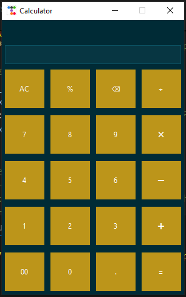

# CalculatorADV
**Open Source Advanced Calculator** is a powerful, customizable tool for basic and advanced math operations. Open to all, anyone can contribute ideas, knowledge, or skills to enhance features and usability, making it a smarter and more collaborative calculator for everyone.
<br>

# 🧮 Open Source Advanced Calculator

**Open Source Advanced Calculator** is a powerful, customizable desktop calculator built with Python and `ttkbootstrap`. It supports both basic and advanced math operations with a modern UI. Open to all, anyone can contribute ideas, knowledge, or skills to enhance features and usability—making it a smarter and more collaborative calculator for everyone.

---

## 🚀 Features

- ✔️ Basic Arithmetic: Addition, Subtraction, Multiplication, Division
- ✳️ Advanced Input Handling: 
  - Smart operator placement
  - Decimal point validation
  - Percentage calculation
- 🔁 Expression Formatter: Cleans invalid inputs like leading/trailing operators
- 🔙 Backspace and All-Clear (`AC`) support
- 🌗 Themed UI using `ttkbootstrap` (`solar` theme)
- 🔢 Formula display and result separation

---

## 📸 Screenshot




---

## 🛠️ Tech Stack

- 🐍 **Python 3**
- 🎨 **Tkinter** with `ttkbootstrap`
- 🔣 **Regular Expressions** for input validation

---

## 📦 Installation

```bash
# Clone the repository
git clone https://github.com/Alexashok99/CalculatorADV.git
cd advanced-calculator

# Install dependencies
pip install ttkbootstrap
